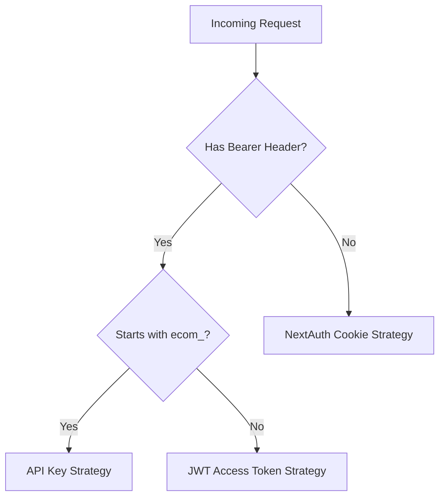
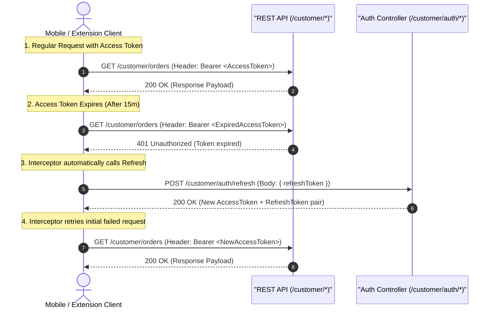

# Ecom Authentication System — Technical Documentation

This document describes the design, architecture, database schemas, authentication strategies, and implementation details of the authentication and session management system in the **Ecom** monorepo.

---

## 1. Overview & Core Patterns

The authentication system is built to balance **maximum security** for administrative access, **seamless UX** for customers, and **flexibility** for API-driven integrations.

To achieve this, the system implements three core architectural patterns:

1. **Dual Auth Architecture**: Supports multiple transport mechanisms (Cookie, JWT, API Key) depending on client types.
2. **Hybrid Session Timeout Pattern**: Combines Absolute, Idle, and Sliding Window timeouts to limit the validity window of sessions.
3. **Optimized Redis Caching**: Minimizes database round-trips by caching session payloads along with critical user metadata, invalidated on key mutations.

---

## 2. Dual Auth Architecture & Client Strategies

The backend (`apps/api` using NestJS) supports multiple client entry points and automatically resolves authentication via the `ApiAuthStrategy` middleware:

| Client Type | Authentication Method | Transport | Context / Role | Lifespan / TTL |
| :--- | :--- | :--- | :--- | :--- |
| **Admin Web App** | NextAuth.js Session Cookie | HTTP Cookie (`httpOnly`, secure) | Administrators / Staff | 7 Days (Sliding), 72h Max |
| **Customer Web App** | NextAuth.js Session Cookie | HTTP Cookie (`httpOnly`, secure) | Customers | 30 Days (Sliding), 90d Max |
| **Mobile & Extensions** | JWT Access & Refresh Token | `Authorization: Bearer <JWT>` | Customers | Access: 15m, Refresh: 30d |
| **Scripts & CI/CD** | API Key | `Authorization: Bearer ecom_<Key>` | Programmatic API Access | Permanent / Configured |

### Auth Resolution Pipeline (`ApiAuthStrategy`)



---

## 3. Detailed Authentication Strategies

### 3.1 Admin & Customer Web Apps (NextAuth.js Session Cookie Strategy)

Web applications (`apps/web` and `apps/customer`) utilize NextAuth.js with a custom adapter wrapper using the `"jwt"` session strategy, storing a random UUID `sessionToken` inside a secure `httpOnly` cookie.

#### Authentication Providers (Customer Web App)

* **Credentials Provider (Email/Username + Password)**:
  * **Verification Code Flow**: Sends an OTP code to customer email (`/send-code`) before finalizing registration.
  * **Password Reset Flow**: Generates verification token for password reset links without revealing email existence.
* **OAuth / Social Login Providers**:
  * **Google OAuth** & **Facebook OAuth**.
  * **Social Account Linking**: Checks `CustomerSocialAccount` by `provider` and `providerAccountId`. If existing, updates `lastLoginAt`. If email exists in `Customer` table, links the social account; otherwise, provisions a new `Customer` record automatically.

#### Session Storage & Caching

* **PostgreSQL**: Persisted in `sessions` (Admin) and `customer_sessions` (Customer) tables.
* **Redis Cache**: Cached as `admin_session:${sessionToken}` or `customer_session:${sessionToken}`.

---

### 3.2 Mobile App & Browser Extensions (JWT Access & Refresh Token Strategy)

Mobile applications and browser extensions communicate directly with NestJS REST API endpoints (`/customer/auth/*`) or tRPC routers using JWT pairs.

#### Token Specifications (`CustomerTokenService`)

* **Access Token**:
  * **TTL**: **15 Minutes** (`15m`).
  * **Signature**: Signed with `JWT_SECRET` (Issuer: `ecom`, Audience: `ecom-customer`).
  * **Transport**: Passed in HTTP Header `Authorization: Bearer <accessToken>`.
  * **Validation**: Verified by `CustomerJwtGuard`.
* **Refresh Token**:
  * **TTL**: **30 Days** (`30d`).
  * **Signature**: Signed with `JWT_REFRESH_SECRET` (or `JWT_SECRET`).
  * **Transport**: Submitted in request body to `/customer/auth/refresh`.

#### Storage & Server-Side Revocation (Redis State)

* **Client Storage**: Tokens are stored client-side in Secure Storage (iOS Keychain / Android EncryptedSharedPreferences) or app memory. The server does NOT store raw JWTs in PostgreSQL.
* **Token Blacklisting (Logout)**: Upon calling `/customer/auth/logout`, the Refresh Token's `jti` is stored in Redis:
  * **Redis Key**: `customer:token_blacklist:${jti}`
  * **TTL**: Equal to token remaining lifespan (max 30 days).
* **Global Revocation (Password Change / Security Reset)**: Calling `revokeAllTokens(customerId)` writes a Unix timestamp to Redis:
  * **Redis Key**: `customer:revoked_before:${customerId}`
  * **Validation**: Any token issued before this timestamp (`iat < revokedBefore`) is automatically rejected.

#### Standard Client Interceptor Refresh Flow



---

### 3.3 B2B Active Token Caching & Brute-Force Shield (`POST /v1/customer/auth/login`)

To protect server CPU against repeated login calls from external B2B integration scripts (ERP/Store automation):

* **Redis Active Token Cache**:
  * **Key**: `cache:customer-active-token:${customerId}:${deviceHash}`
  * **TTL**: **13 Minutes** (`780s`, 2-minute safety buffer gap before Access Token expiry).
  * **Behavior**: If an active token pair exists in Redis for a customer device, `/customer/auth/login` returns the cached response in `< 3ms`, completely bypassing `bcrypt` password hashing (0-bcrypt CPU) and eliminating `updateLastLogin` database queries.
* **Brute-Force Lockout**:
  * **Key**: `ratelimit:customer-login-fails:${identifier}`
  * **Threshold**: **5 Consecutive Failures in 15 Minutes**.
  * **Behavior**: Temporarily locks login attempts for 15 minutes (`HTTP 429`), protecting server CPU against password guessing attacks.
* **Immediate Security Eviction**:
  * Changing password (`changePassword`), resetting password (`resetPassword`), account suspension, or calling `logout` automatically invalidates all active token cache keys for that customer (`invalidateActiveTokens`).

---

### 3.4 API Key Strategy (`Authorization: Bearer ecom_<Key>`)

Used for programmatic API access, scripts, and internal microservices:

* Identifiers start with the `ecom_` prefix.
* Resolved by `ApiAuthStrategy` before reaching NestJS controllers.
* Skips session cookies and JWT verification.

---

## 4. Database Schema

Session data is persisted in PostgreSQL to allow server-side revocation. The schema segregates admin sessions from customer sessions for security isolation.

```prisma
model Session {
  id           String   @id @default(cuid())
  sessionToken String   @unique
  userId       Int
  user         User     @relation(fields: [userId], references: [id], onDelete: Cascade)
  expires      DateTime
  loginAt      DateTime @default(now())
  lastActiveAt DateTime @default(now())
  ipAddress    String?
  userAgent    String?
  createdAt    DateTime @default(now())
  updatedAt    DateTime @updatedAt

  @@index([userId])
  @@map("sessions")
}

model CustomerSession {
  id           String   @id @default(cuid())
  sessionToken String   @unique
  customerId   Int
  customer     Customer @relation(fields: [customerId], references: [id], onDelete: Cascade)
  expires      DateTime
  loginAt      DateTime @default(now())
  lastActiveAt DateTime @default(now())
  ipAddress    String?
  userAgent    String?
  createdAt    DateTime @default(now())
  updatedAt    DateTime @updatedAt

  @@index([customerId])
  @@map("customer_sessions")
}
```

---

## 5. Hybrid Session Timeout Design

A standard sliding window timeout (extending the session indefinitely on every request) is vulnerable to session hijacking if a token is compromised. Ecom utilizes a **3-tier hybrid timeout model**:

1. **Absolute Timeout**: A hard limit from the initial login time (`loginAt`). Once reached, the user must re-authenticate, regardless of recent activity.
2. **Idle Timeout**: Expires the session if there is no activity (`lastActiveAt`) within a specific threshold.
3. **Sliding Window**: Extends the session expiration time (`expires`) only when the session approaches its expiry threshold.

### Session Configuration Parameters

| Parameter | Admin App (`apps/admin`) | Customer App (`apps/customer`) | Purpose |
| :--- | :--- | :--- | :--- |
| **Session Max Age (Sliding)** | **7 Days** | **30 Days** | Base duration of a session |
| **Absolute Timeout** | **72 Hours** (3 Days) | **90 Days** | Forced logout limit |
| **Idle Timeout** | **2 Hours** | **7 Days** | Expiration due to inactivity |
| **Sliding Window Threshold** | **25%** remaining (~42h) | **50%** remaining (15d) | Triggers expiration extension |
| **Redis Cache TTL** | **15 Seconds** | **30 Seconds** | Frequency of DB check bypasses |
| **Max Sessions per User** | **5** | **10** | Prevents concurrent device abuse |
| **lastActiveAt Throttle** | **5 Minutes** | **5 Minutes** | Min interval to update DB activity |

---

## 6. Optimized Redis Caching Layer

To prevent write amplification and excessive database round-trips on every HTTP request, a caching layer is implemented on top of Redis.

### 6.1 Structure of Redis Cache Key

* Admin: `admin_session:${sessionToken}`
* Customer: `customer_session:${sessionToken}`

### 6.2 0-DB Round-Trip on Cache Hit

Instead of caching only the session state and performing a separate query for the user model, Ecom queries the user/customer info alongside the session using Prisma `select` on cache misses, storing the combined payload.
On cache hits, the entire session metadata and user roles/display properties are resolved directly from Redis, resulting in **zero database queries** for authenticated requests.

### 6.3 Cache Invalidation Rules

The cached session payload is deleted from Redis in the following scenarios:

* **Sign Out**: Calling `signOut()` deletes the session from the DB and deletes the Redis key.
* **Session Extension**: When the sliding window triggers a session expiration renewal in the DB, the cache is invalidated so the next request gets the new expiry date.

---

## 7. Detailed Authentication Code Flow

NextAuth is configured with a custom adapter wrapper using the `"jwt"` session strategy. The session token stored in the client cookie is a random UUID (`sessionToken`).

```text
[Request]
   │
   ▼
1. NextAuth extracts Cookie -> sessionToken
   │
   ▼
2. decode({ token: sessionToken })
   │
   ├── [Cache Hit] ──> Returns cached session payload (0 DB Queries)
   │
   └── [Cache Miss] ──> Query DB (Session + User/Customer relation)
         │
         ├── Check Absolute Timeout (now - loginAt > absoluteLimit) ──> Evict & Deny
         │
         ├── Check Idle Timeout (now - lastActiveAt > idleLimit) ──> Evict & Deny
         │
         ├── Check Sliding Window Threshold
         │     ├── Yes (Near expiry) ──> Update expires + lastActiveAt in DB, Invalidate Redis
         │     └── No ──> Check Activity Throttle (> 5m since lastActiveAt) ──> Update lastActiveAt in DB
         │
         └── Write combined payload to Redis (TTL 15-30s)
   │
   ▼
3. session({ token }) callback
   │
   ▼
4. Gán token payload -> session.db (No extra DB queries for user fields)
```

### Shared Caching Utilities ([session-cache.ts](file:///Users/tuandang/Data/FlashShip/ecom/packages/lib/src/session-cache.ts))

Shared methods reside in `@ecom/lib/session-cache` to maintain DRY (Don't Repeat Yourself) compliance:

```typescript
import { getRedisClient } from "@ecom/lib/redis";

export async function getCachedSession(cacheKey: string): Promise<Record<string, unknown> | null> {
  try {
    const redis = getRedisClient();
    const cached = await redis.get(cacheKey);
    if (cached) return JSON.parse(cached);
  } catch {}
  return null;
}

export async function setCachedSession(
  cacheKey: string,
  payload: Record<string, unknown>,
  ttlSeconds: number,
): Promise<void> {
  try {
    const redis = getRedisClient();
    await redis.set(cacheKey, JSON.stringify(payload), "EX", ttlSeconds);
  } catch {}
}

export async function invalidateCachedSession(cacheKey: string): Promise<void> {
  try {
    await getRedisClient().del(cacheKey);
  } catch {}
}
```

---

## 8. Security Hardening Measures

* **No Sensitive Leakage**: Fields like `password`, `hashedKey`, `tokenHash`, or `refreshTokenHash` are never requested or exposed in Prisma queries (`select` is strictly used instead of `include`).
* **Environment-Aware Debugging**: NextAuth's `debug` configuration is tied to the running environment (`debug: env.NODE_ENV === "development"`). This prevents session database queries and token values from being leaked into production logs.
* **Session Limit Enforcement**: Upon every successful login credentials handshake, the `jwt` callback queries the database for existing sessions for that user. If the count exceeds the configured limit (e.g. 5 for Admin, 10 for Customer), the oldest sessions (ordered by `lastActiveAt`) are immediately pruned.
