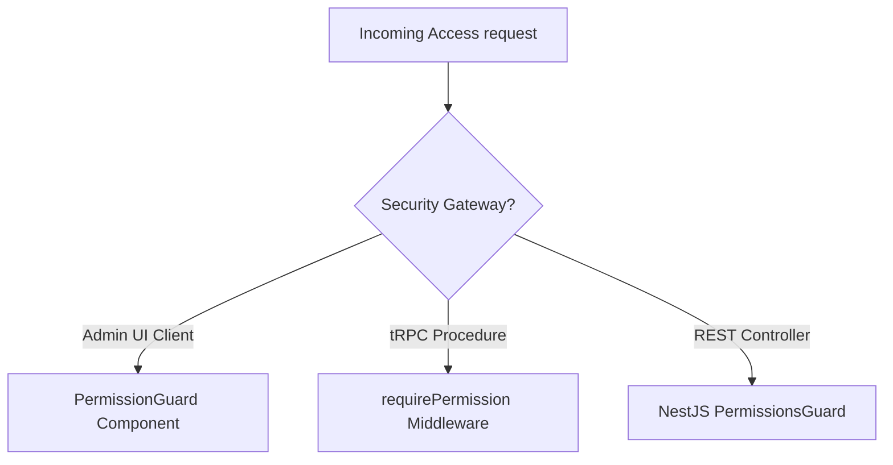
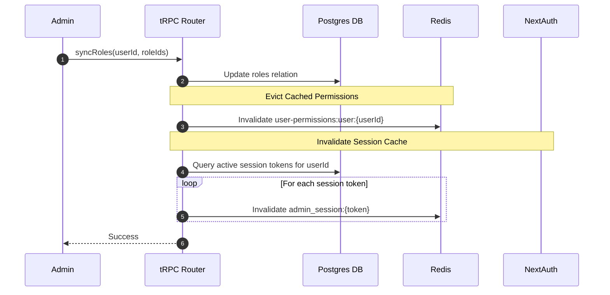

# Ecom Authorization System — Technical Documentation

This document describes the design, architecture, caching lifecycle, and implementation details of the Role-Based Access Control (RBAC) and permission validation system in the **Ecom** monorepo.

---

## 1. Overview & Core Patterns

The authorization system is built to enforce fine-grained privileges across the entire monorepo, keeping administrative interfaces secure, REST APIs protected, and user experiences highly reactive.

The system implements four core engineering patterns:
1. **Unified Permission Engine**: Centralizes permission definitions (`@ecom/lib/permissions`) and supports wildcard overrides (`*`) for super administrators.
2. **Dual Gateway Protection**: Secures both administrative Next.js tRPC procedures and API-driven NestJS REST endpoints under a single validation model.
3. **Resilient Permission Caching**: Stores parsed permissions in Redis to eliminate database joins, with immediate local Postgres fallback if the Redis service goes offline.
4. **Lifecycle Eviction**: Immediately evicts cached privileges and NextAuth sessions when critical updates occur (roles syncing, password resets, account suspension/banning).

---

## 2. RBAC & Permission Model

Permissions are defined as unique granular string keys. Roles are groups of permissions assigned to users.

### 2.1 Wildcard Administrator Support
If a user is assigned a permission string containing `*`, the validation helpers immediately bypass all specific permission checks and authorize the operation.

### 2.2 Permissions Helper (`hasPermission`)
Shared methods in `@ecom/shared` check for privileges by evaluating the user's active session permissions list:

```typescript
// packages/shared/src/@app/utils/appUtils.ts
export function hasPermission(user: { permissions?: string[] }, required: string[]): boolean {
  if (!user) return false;
  const userPerms = user.permissions ?? [];
  
  // Super Administrator Bypass
  if (userPerms.includes("*")) return true;
  
  // Validate presence of all required permissions
  return required.every(perm => userPerms.includes(perm));
}
```

---

## 3. Caching & Outage Resilience

To prevent excessive joins on the database, permissions are cached in Redis under the `user-permissions` namespace.

### 3.1 Cache Namespace Format
- Cache Key: `user-permissions:user:${userId}`
- TTL: **3600 Seconds** (1 Hour)

### 3.2 Redis Outage Resiliency
If the local Redis service crashes or goes offline, calling cache methods throws an exception. Ecom wraps all caching requests in safe try-catch blocks to prevent server crash loops:

```typescript
// packages/lib/src/redis.ts
export class RedisCache<T> {
  async get(key: string): Promise<T | undefined> {
    try {
      const redis = getRedisClient();
      const raw = await redis.get(this.key(key));
      if (!raw) return undefined;
      return JSON.parse(raw) as T;
    } catch (err: unknown) {
      log.error("Redis get cache error, falling back to database", {
        key,
        error: err instanceof Error ? err.message : String(err),
      });
      return undefined; // Falls back to PostgreSQL DB
    }
  }
}
```

---

## 4. Guards & Security Gateways

Security is enforced at three distinct gateways: Client-Side UI, tRPC API Layer, and NestJS REST Endpoints.



### 4.1 Client-Side: Next.js `PermissionGuard`
The admin dashboard uses the `<PermissionGuard>` layout wrapper to hide pages and panels.

* **`mode="section"` (Default)**: Renders a localized inline warning banner (for widgets/actions).
* **`mode="page"`**: Renders a premium, full-screen animated **403 Access Denied** template ([Error403Page.tsx](file:///Users/tuandang/Data/FlashShip/ecom/apps/admin/src/components/errors/Error403Page.tsx)) for routing protection.

```tsx
// apps/admin/src/components/layout/PermissionGuard.tsx
export function PermissionGuard({ permissions, children, fallback, mode = "section" }: PermissionGuardProps) {
  const { isLoading, hasPermission } = useRequirePermission(permissions);
  const t = useTranslations("errors");

  if (isLoading) return <Spinner />;

  if (!hasPermission) {
    if (fallback !== undefined) return <>{fallback}</>;
    if (mode === "page") return <Error403Page />;

    return (
      <div className="inline-error-banner">
        <AlertCircle className="size-4" />
        {t("FORBIDDEN")}
      </div>
    );
  }

  return <>{children}</>;
}
```

---

### 4.2 tRPC Layer: API Handlers
tRPC procedures verify access privileges using procedure modifiers:

```typescript
export const list = authedProcedure
  .use(requirePermission(Permissions.USERS_READ))
  .query(async () => {
    return userService.listUsers();
  });
```

* **Brute Force Protection**: Mutations like `create` and `changePassword` prepend `rateLimiters.mutation` to limit requests to 30 submissions per minute.

---

### 4.3 NestJS REST API: Endpoint Controllers
REST endpoints protect API keys and mobile app access tokens via `@RequirePermissions` annotations and the NestJS `PermissionsGuard`.

```typescript
@Controller('v2/users')
@UseGuards(PermissionsGuard)
export class UserController {
  @Post()
  @RequirePermissions(Permissions.USERS_CREATE)
  async createUser(@Body() dto: CreateUserDto) {
    return this.userService.create(dto);
  }
}
```

---

## 5. Lifecycle Invalidation & Cache Eviction

To prevent privilege escalation and secure restricted sessions in real-time, the system automatically invalidates cached data when user structures change.



### Invalidation Triggers
The cache invalidation pipeline is executed on these actions:
* **Account Status Modification**: If a user is `SUSPENDED` or `BANNED`, their cached permissions and sessions are immediately evicted.
* **Password Change**: Resets user credentials and invalidates active session caches across all logged-in devices.
* **Role/Permission Sync**: Clearing a role or editing a role's permissions evicts active privileges for all associated users.

---

## 6. UX: Optimistic Updates

Role syncing and user info updates on the administrator table utilize TanStack Query **Optimistic Updates** to write changes directly to the list cache before server resolution.

On mutation failures, the application rollback logic restores the previous list cache snapshot:

```typescript
// apps/admin/src/app/(main)/system/users/page.tsx
const syncRolesMutation = trpc.viewer.users.syncRoles.useMutation({
  onMutate: async (variables) => {
    if (!variables) return;
    await utils.viewer.users.list.cancel();

    const queryKey = { search: debouncedSearch, status: statusFilter, page, perPage: 20 };
    const previousUsers = utils.viewer.users.list.getData(queryKey);

    if (previousUsers) {
      const mappedRoles = variables.roleIds.map(id => ({
        role: { id, name: roles?.find(r => r.id === id)?.name ?? "" }
      }));

      // Optimistically update roles list
      utils.viewer.users.list.setData(queryKey, {
        ...previousUsers,
        data: previousUsers.data.map(user => 
          user.id === variables.userId ? { ...user, roles: mappedRoles } : user
        )
      });
    }

    return { previousUsers, queryKey };
  },
  onError: (err, _variables, context) => {
    // Revert query cache to previous state on failure
    if (context?.previousUsers) {
      utils.viewer.users.list.setData(context.queryKey, context.previousUsers);
    }
    toast(err.message || "Failed to update roles", "error");
  },
  onSettled: () => {
    // Invalidate and trigger background sync
    utils.viewer.users.list.invalidate();
    utils.viewer.users.get.invalidate();
  }
});
```
