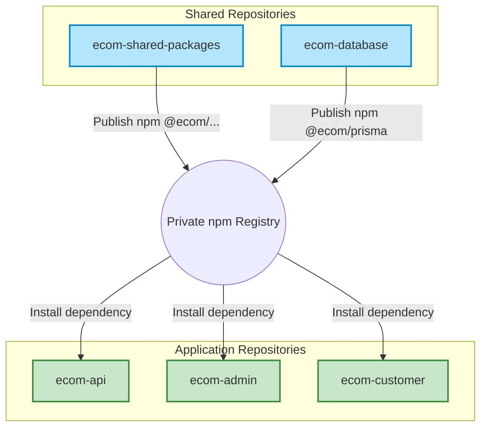

# Technical Design: Monorepo to Multi-Repo Migration Plan (Approach 2)

This document contains the detailed migration plan to split the existing `ecom` monorepo into individual, isolated repositories. The objective is to enforce **strict developer access controls** so that developers assigned to specific applications (e.g., Customer App) only have access to that application's repository.

---

## Proposed Target Repository Topology

We will split the current monorepo into **5 distinct repositories**:



### 1. `ecom-shared-packages` (Shared Repository)
- **Contains**: Shared workspace utilities (`packages/lib`, `packages/config`, `packages/types`, `packages/ui`, `packages/i18n`, `packages/emails`, `packages/tsconfig`).
- **Access**: Only core maintainers and lead engineers.
- **Output**: Automated release pipeline publishing packages under the `@ecom` scope (e.g. `@ecom/ui`, `@ecom/lib`) to a private registry.

### 2. `ecom-database` (Shared Database Repository)
- **Contains**: Database schema (`packages/prisma/schema.prisma`), migrations, seed scripts, and generate scripts.
- **Access**: Core team and backend engineers.
- **Output**: Publishes generated Prisma client definitions to the private registry.

### 3. `ecom-api` (Application Repository)
- **Contains**: NestJS REST API (`apps/api/v2`).
- **Access**: Backend engineers.
- **Dependencies**: Installs `@ecom/lib`, `@ecom/prisma`, etc., from the private registry.

### 4. `ecom-admin` (Application Repository)
- **Contains**: Next.js Admin CMS (`apps/admin`).
- **Access**: Admin frontend engineers.

### 5. `ecom-customer` (Application Repository)
- **Contains**: Next.js Customer App (`apps/customer`).
- **Access**: Customer frontend engineers.

---

## Step-by-Step Migration Phases

### Phase 1: Establish Private Registry Authentication
Since the code is hosted on GitHub, we will leverage **GitHub Packages** as our private npm registry.

1. **GitHub Personal Access Token (PAT)**:
   - Create a service account PAT with `write:packages` and `read:packages` scopes.
2. **Configure Authentication (`.npmrc`)**:
   Create a `.npmrc` file at the root of developer workspaces and in CI environments:
   ```env
   @ecom:registry=https://npm.pkg.github.com
   //npm.pkg.github.com/:_authToken=${GITHUB_TOKEN}
   ```

---

### Phase 2: Extract & Configure Shared Packages (`ecom-shared-packages`)
1. Create a new repository: `ecom-shared-packages`.
2. Move `packages/lib`, `packages/config`, `packages/types`, `packages/ui`, `packages/i18n`, `packages/emails`, and `packages/tsconfig` into the new repository.
3. Setup **Changesets** (recommended) or **Lerna** to automate package versioning.
4. Set up a GitHub Action to auto-publish version updates to GitHub Packages:
   ```yaml
   # .github/workflows/publish.yml excerpt
   - name: Publish to GitHub Packages
     run: yarn changeset publish
     env:
       GITHUB_TOKEN: ${{ secrets.GITHUB_TOKEN }}
   ```

---

### Phase 3: Extract & Configure Database Package (`ecom-database`)
1. Create a new repository: `ecom-database`.
2. Move `packages/prisma` into the repository.
3. Configure `package.json` to build and export compiled Prisma types:
   ```json
   {
     "name": "@ecom/prisma",
     "version": "1.0.0",
     "main": "dist/index.js",
     "types": "dist/index.d.ts",
     "scripts": {
       "build": "prisma generate && tsc"
     }
   }
   ```
4. Set up a pipeline to auto-publish `@ecom/prisma` version increments to the private registry.

---

### Phase 4: Spin Off Backend API (`ecom-api`)
1. Create a new repository: `ecom-api`.
2. Copy `apps/api/v2` contents to the root of the repo.
3. Remove workspace configs (`yarn.lock` links to other apps).
4. Update `package.json` to import packages from the registry:
   ```json
   "dependencies": {
     "@ecom/config": "^1.0.0",
     "@ecom/features": "^1.0.0",
     "@ecom/lib": "^1.0.0",
     "@ecom/prisma": "^1.0.0",
     "@ecom/types": "^1.0.0",
     // nestjs dependencies...
   }
   ```
5. Set up dedicated CI/CD triggers to deploy the NestJS API container/VPS bundle.

---

### Phase 5: Spin Off Frontend Applications (`ecom-admin` & `ecom-customer`)
1. Create `ecom-admin` and `ecom-customer` repositories.
2. Port respective next.js application files.
3. Replace local workspace references in `package.json` with package versions retrieved from GitHub Packages.
4. Grant repository access ONLY to the engineers assigned to those modules.

---

### Phase 6: Local Development Workflow (Optimizing Dev Velocity)
Working across multiple repositories can introduce latency because making changes in a shared package requires publishing a new version before the frontend can import it.

To preserve fast development iterations, developers will use **yalc** or **Yarn Link**:

```bash
# In ecom-shared-packages/packages/ui:
yarn build
yalc publish

# In ecom-admin:
yalc add @ecom/ui
# This links the local package directly without hitting the remote npm registry
```

---

## Architectural Open Questions

> [!IMPORTANT]
> 1. **How should we handle tRPC boundaries?** Next.js apps currently import types from `packages/trpc/server/routers/_app` directly to get type-safe queries. If we split the repo, we must publish the tRPC router types (e.g. `@ecom/trpc`) as a package from the backend repo, and the frontends will install `@ecom/trpc`.
> 2. **Shared UI package development**: How frequently does the team modify the UI component styles (`packages/ui`)? If UI modifications are very frequent, keeping `ecom-admin` and `ecom-customer` split might slow down frontend UI design. Should we consider keeping `@ecom/ui` in the frontend repos, or is publishing updates acceptable?
